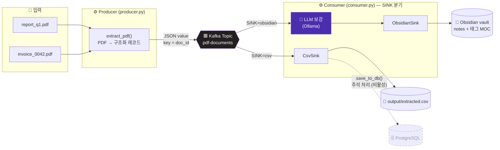
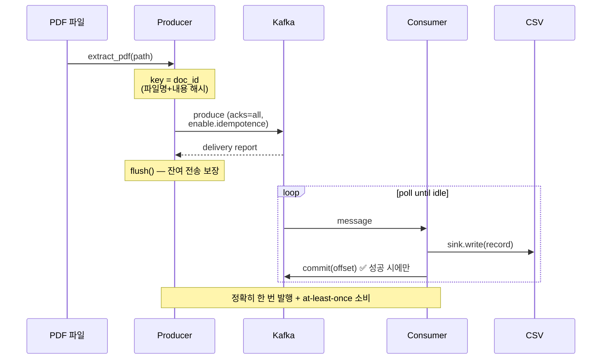
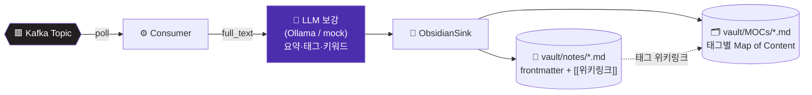
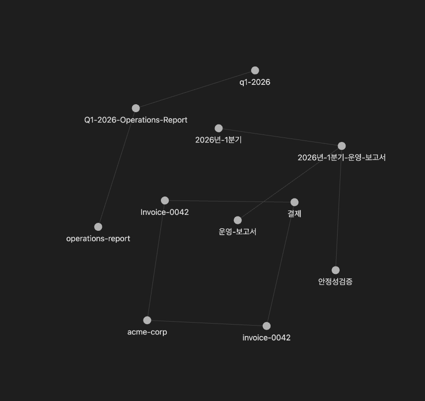

# A003 · PDF → Kafka → Obsidian 지식 파이프라인

> PDF 문서를 자동 추출해 **Apache Kafka**로 스트리밍하고, **로컬 LLM(Ollama)** 으로 요약·태그를 보강해
> **Obsidian 지식 노트**(frontmatter · `[[위키링크]]` · 태그 MOC)로 적재하는 데이터 파이프라인입니다.
>
> 출력 싱크는 `SINK` 환경변수로 교체할 수 있습니다:
> - **`obsidian`** — LLM 보강 후 Obsidian vault에 지식 노트 생성 *(메인)*
> - **`csv`** — 추출 결과를 CSV로 적재 (DB 저장 스텁은 주석으로 보존)

<p>
  
  
  
  
  
</p>

---

## 📐 아키텍처



### 전달 보장 (Delivery Guarantee)



---

## ✨ 특징

| 항목 | 설명 |
|------|------|
| **멱등 식별** | 메시지 key = `doc_id`(파일명 + 내용 SHA-256 해시) → 동일 문서는 같은 파티션으로 라우팅, 재처리 식별 가능 |
| **정확히 한 번 발행** | Producer `acks=all` + `enable.idempotence=True` |
| **at-least-once 소비** | Consumer 수동 커밋 — 싱크 적재 성공 건만 오프셋 커밋 |
| **교체 가능한 싱크** | `SINK` 환경변수로 `csv` ↔ `obsidian` 전환, 동일 스트림을 다른 출력으로 |
| **LLM 보강 (provider 추상화)** | `obsidian` 모드에서 Ollama로 요약·태그·키워드 생성, `mock`으로 의존성 없이 검증 |
| **장애 격리** | 한 PDF 파싱/보강 실패가 전체 파이프라인을 멈추지 않음 (건 단위 예외 격리) |
| **배치성 종료** | `consumer_timeout_ms` 동안 신규 메시지 없으면 컨슈머 자동 종료 |
| **설정 외부화** | 브로커·토픽·경로·LLM 전부 환경 변수로 오버라이드, 시크릿 하드코딩 없음 |
| **DB 확장 지점** | `full_text`를 payload에만 보관 → 주석 해제만으로 DB 적재 활성화 |

---

## 🗂️ 프로젝트 구조

```text
A003-pdf-kafka-pipeline/
├── run_pipeline.py        # CLI 엔트리포인트 (produce / consume / all)
├── requirements.txt       # confluent-kafka, pdfplumber
├── README.md
├── pipeline/
│   ├── config.py          # 환경변수 기반 설정 (불변 dataclass)
│   ├── extractor.py       # PDF → 구조화 레코드(dict)
│   ├── producer.py        # PDF 추출 → Kafka 토픽 발행
│   ├── consumer.py        # 토픽 구독 → 싱크 분기(csv|obsidian)
│   ├── enrich.py          # LLM 보강 (Ollama 기본 + mock)
│   ├── obsidian_sink.py   # 마크다운 노트 + 태그 MOC 생성
│   └── sink.py            # CSV 적재 + DB 저장 스텁(주석)
├── scripts/
│   └── make_korean_sample.py  # 한글 샘플 PDF 생성기 (Pretendard)
├── fonts/                 # 번들 폰트 (Pretendard, OFL)
├── docs/                  # README 자산 (graph-view.png)
├── sample_pdfs/           # 입력 PDF (테스트 픽스처 포함)
├── output/                # extracted.csv 생성 위치 (csv 모드)
└── vault/                 # Obsidian 노트·MOC 생성 위치 (obsidian 모드)
```

---

## 🚀 빠른 시작

### 1. 설치

```bash
git clone <repo-url> && cd A003-pdf-kafka-pipeline
python -m venv .venv && source .venv/bin/activate
pip install -r requirements.txt
```

### 2. Kafka 브로커 (로컬, KRaft 모드 — Zookeeper 불필요)

```bash
docker run -d --name kafka -p 9092:9092 apache/kafka:3.8.0
```

### 3. 실행

```bash
# sample_pdfs/ 에 PDF를 넣고 ↓
python run_pipeline.py produce     # PDF → Kafka 발행
python run_pipeline.py consume     # Kafka → CSV 적재
python run_pipeline.py all         # 발행 + 적재 한 번에
```

---

## ⚙️ 환경 변수

| 변수 | 기본값 | 설명 |
|------|--------|------|
| `KAFKA_BOOTSTRAP_SERVERS` | `localhost:9092` | 브로커 주소 (쉼표 구분) |
| `KAFKA_TOPIC` | `pdf-documents` | 토픽명 |
| `KAFKA_CONSUMER_GROUP` | `pdf-csv-writer` | 컨슈머 그룹 |
| `KAFKA_CONSUMER_TIMEOUT_MS` | `10000` | 신규 메시지 대기 후 종료 (ms) |
| `PDF_DIR` | `sample_pdfs` | 입력 PDF 디렉토리 |
| `OUTPUT_CSV` | `output/extracted.csv` | 출력 CSV 경로 |
| `CSV_ENCODING` | `utf-8-sig` | CSV 인코딩 (Excel 한글 호환용 BOM 포함) |
| `SINK` | `csv` | 출력 싱크 선택: `csv` \| `obsidian` |
| `LLM_PROVIDER` | `ollama` | 보강 LLM: `ollama` \| `mock` (obsidian 싱크에서만 사용) |
| `OLLAMA_URL` | `http://localhost:11434` | Ollama 서버 주소 |
| `OLLAMA_MODEL` | `llama3.1` | Ollama 모델명 |
| `VAULT_DIR` | `vault` | Obsidian vault 출력 디렉토리 |

---

## 📄 CSV 스키마

```
doc_id, source_file, page_count, char_count, title, extracted_at, text_preview
```

예시 출력:

```csv
doc_id,source_file,page_count,char_count,title,extracted_at,text_preview
e953006323a7b6bf,invoice_0042.pdf,1,68,Invoice #0042,2026-06-03T03:51:18+00:00,"Invoice #0042..."
f8b8a876cc574f3c,report_q1.pdf,1,128,Q1 2026 Operations Report,2026-06-03T03:51:18+00:00,"Q1 2026..."
```

> 전체 본문(`full_text`)은 CSV에는 포함하지 않고 메시지 payload에만 담아두어,
> DB 저장 주석을 해제하면 그대로 적재할 수 있도록 설계했습니다.

---

## 🇰🇷 한글 폰트 지원

파이프라인은 **추출 → 발행 → 적재 전 구간이 UTF-8** 기반이라 한글 PDF를 그대로 지원합니다.

| 단계 | 처리 |
|------|------|
| 추출 (`extractor.py`) | `pdfplumber`가 한글 PDF 텍스트를 그대로 추출 |
| 발행 (`producer.py`) | `json.dumps(..., ensure_ascii=False)` → 한글 비이스케이프 직렬화 |
| 적재 (`sink.py`) | CSV를 `utf-8-sig`(BOM)로 기록 → **Excel에서 열어도 한글이 깨지지 않음** |

> 순수 UTF-8이 필요하면 `CSV_ENCODING=utf-8` 로 BOM을 끌 수 있습니다.

### 한글 샘플 PDF 생성 (Pretendard)

코어 폰트(Helvetica)는 latin-1만 지원하므로 한글을 렌더링하려면 유니코드 폰트를 임베드해야 합니다.
저장소에는 **Pretendard TTF**(OFL 라이선스)가 `fonts/`에 번들되어 있습니다.

```bash
pip install fpdf2                       # 샘플 생성 전용 (런타임 의존성 아님)
python scripts/make_korean_sample.py    # → sample_pdfs/report_kr.pdf
python run_pipeline.py all              # 한글 PDF → Kafka → CSV
```

> ⚠️ fpdf2로 PDF를 만들 땐 **TTF**를 쓰세요. OTF/CFF는 임베드는 되지만
> `pdfminer`가 글리프를 디코딩하지 못해 추출 결과가 0자가 되는 경우가 있습니다
> (본 저장소에서 검증한 이슈).

## 🧠 Obsidian 지식 베이스 모드

`SINK=obsidian`으로 실행하면 CSV 대신 **Obsidian vault에 구조화된 지식 노트**를 생성합니다.
컨슈머가 메시지를 받으면 **LLM(Ollama)** 으로 요약·핵심포인트·태그·키워드를 보강한 뒤,
YAML frontmatter + `[[위키링크]]` + 태그별 MOC를 갖춘 마크다운 노트로 적재합니다.



생성된 노트는 태그를 `[[위키링크]]`로 연결하고, 같은 태그를 가진 문서들은 **태그 MOC** 노트로 묶여
Obsidian **그래프뷰에서 문서들이 주제 중심으로 연결된 지식망**으로 나타납니다.



> 위 그래프는 PDF 3건을 Ollama(`llama3.2:3b`)로 보강해 생성한 실제 vault를 Obsidian 그래프뷰로 연 것입니다.
> 각 문서 노트가 LLM이 추출한 태그(`operations-report`, `결제`, `안정성검증` 등) MOC와 연결됩니다.

### 실행

```bash
# 1) Ollama 준비 (로컬 LLM) — https://ollama.com
ollama pull llama3.2:3b          # 경량 모델 (약 2GB)
ollama serve                      # http://localhost:11434

# 2) Obsidian 싱크로 파이프라인 실행
export SINK=obsidian OLLAMA_MODEL=llama3.2:3b
python run_pipeline.py produce      # PDF → Kafka
python run_pipeline.py consume      # Kafka → LLM 보강 → vault/

# Ollama 없이 구조만 확인하려면 mock provider:
SINK=obsidian LLM_PROVIDER=mock python run_pipeline.py all
```

> ⚠️ **macOS Homebrew 주의**: `brew install ollama`(formula)는 추론 실행기(`llama-server`)가
> 빠져 500 에러가 날 수 있습니다. `brew install --cask ollama`(Ollama.app) 또는 공식 설치본을 쓰세요.

생성된 `vault/` 폴더를 Obsidian에서 **vault로 열면** 노트와 그래프를 바로 확인할 수 있습니다.

### 생성 노트 예시

```markdown
---
title: 2026년 1분기 운영 보고서
source_file: report_q1.pdf
doc_id: a1f3...
created: 2026-06-04T...
tags: [운영-보고서, kafka, 데이터-파이프라인]
keywords: [추출 정확도, 안정성, ...]
---

# 2026년 1분기 운영 보고서

## 요약
1분기 운영 지표와 파이프라인 안정성 검증 결과를 요약합니다.

## 핵심 포인트
- 총 처리 문서 1,284건
- 평균 추출 정확도 97.3%

## 태그
[[운영-보고서]] [[kafka]] [[데이터-파이프라인]]

## 원문 미리보기
...
```

## 🗄️ DB 저장 활성화 방법

`pipeline/sink.py` 에서 두 곳만 주석 해제하면 됩니다:

1. `CsvSink.write()` 안의 `# save_to_db(record)` 호출
2. 파일 하단의 `save_to_db()` 함수 (PostgreSQL `upsert` 예시 포함, `doc_id` PK 기준 중복 방지)

---

## ✅ E2E 테스트 결과

로컬 Kafka(KRaft) 브로커 기준, 두 싱크 모두 검증 완료.

**CSV 모드** — PDF 2건 → Kafka → CSV:

```text
========== PRODUCE ==========
발행 완료: 2건
========== CONSUME ==========
CSV 적재 완료: 2행 → output/extracted.csv
소비 완료: 2건
```

**Obsidian 모드** — PDF 3건 → Kafka → Ollama(`llama3.2:3b`) 보강 → vault:

```text
========== CONSUME (Ollama 보강) ==========
싱크: obsidian
적재: invoice_0042.pdf (doc_id=e953006323a7b6bf)
적재: report_kr.pdf (doc_id=8f5fe9c3a74a5070)
적재: report_q1.pdf (doc_id=f8b8a876cc574f3c)
Obsidian 적재 완료: 노트 3개, 태그 MOC 6개 → vault/notes
```

검증 항목: CSV는 `doc_id`/`char_count` 정상·`full_text` 미포함·헤더 1회, Obsidian은 의미론적 태그 생성 + 그래프뷰 연결 확인(위 스크린샷).
